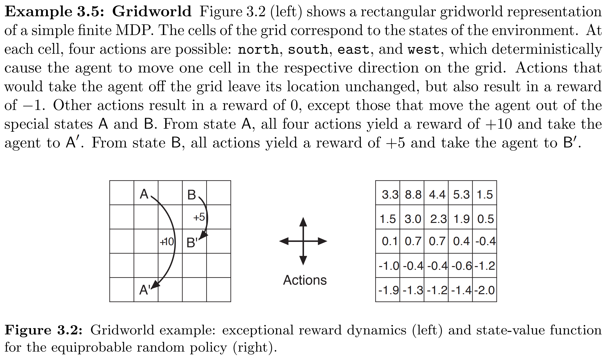
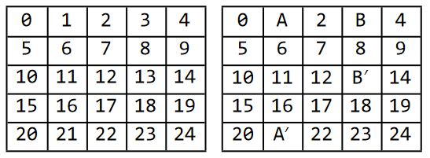
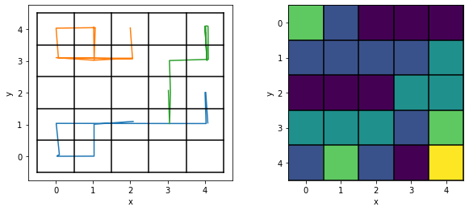
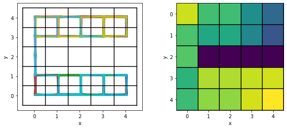
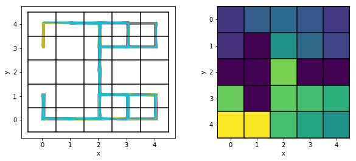
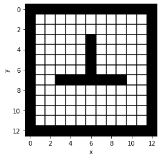

GridWorld
==============

First Example
-----------------

This is the example 3.5 from [S.Sutton2018]_.

For a full example, see how to build this example from the S&B book:

.. code-block:: python

    import numpy as np
    from emdp import actions
    import emdp.gridworld as gw

    def build_SB_example35():
        """
        Example 3.5 from (Sutton and Barto, 2018) pg 60 (March 2018 version).
        A rectangular Gridworld representation of size 5 x 5.

        Quotation from book:
        At each state, four actions are possible: north, south, east, and west, which deterministically
        cause the agent to move one cell in the respective direction on the grid. Actions that
        would take the agent off the grid leave its location unchanged, but also result in a reward
        of −1. Other actions result in a reward of 0, except those that move the agent out of the
        special states A and B. From state A, all four actions yield a reward of +10 and take the
        agent to A'. From state B, all actions yield a reward of +5 and take the agent to B'
        """
        size = 5
        P = gw.build_simple_grid(size=size, p_success=1)
        # modify P to match dynamics from book.

        P[1, :, :] = 0 # first set the probability of all actions from state 1 to zero
        P[1, :, 21] = 1 # now set the probability of going from 1 to 21 with prob 1 for all actions

        P[3, :, :] = 0  # first set the probability of all actions from state 3 to zero
        P[3, :, 13] = 1  # now set the probability of going from 3 to 13 with prob 1 for all actions

        R = np.zeros((P.shape[0], P.shape[1])) # initialize a matrix of size |S|x|A|
        R[1, :] = +10
        R[3, :] = +1

        p0 = np.ones(P.shape[0])/P.shape[0] # uniform starting probability (assumed)
        gamma = 0.9

        terminal_states = []
        return gw.GridWorldMDP(P, R, gamma, p0, terminal_states, size)

where :code:`P` is the transition model
:math:`P: \mathcal{S}\times\mathcal{A}\times\mathcal{S}\mapsto \mathbb{R}`,
:code:`R` is the reward map :math:`r: \mathcal{S}\times\mathcal{A}\mapsto\mathbb{R}`.

To actually use this there is a gym like interface where you can move around:

.. code-block:: python

    mdp = build_SB_example35()
    state = mdp.reset()
    next_state, reward, done, _ = mdp.step(actions.UP) # moves the agent up.

Plotting GridWorlds
^^^^^^^^^^^^^^^^^^^^^^^

.. code-block:: python

    from emdp.gridworld import GridWorldPlotter
    from emdp import actions
    import random

    gwp = GridWorldPlotter(mdp.size, # 5
                           mdp.has_absorbing_state)
    # alternatively you can use GridWorldPlotter.from_mdp(mdp)

    # collect some trajectories from the GridWorldMDP object:

    trajectories = []
    for _ in range(3): # 3 trajectories
        trajectory = [mdp.reset()]
        for _ in range(10): # 10 steps maximum
            state, reward, done, info = mdp.step(random.sample([actions.LEFT, actions.RIGHT,
                                                                actions.UP, actions.DOWN], 1)[0])
            trajectory.append(state)
        trajectories.append(trajectory)

Now ``trajectories`` contains a list of lists of numpy arrays which represent the states.
You can easily obtain trajectory plots and state visitation heatmaps:

.. code-block:: python

    import matplotlib.pyplot as plt

    fig = plt.figure(figsize=(10, 4))
    ax = fig.add_subplot(121)

    # trajectory
    gwp.plot_trajectories(ax, trajectories)
    gwp.plot_grid(ax)

    # heatmap
    ax = fig.add_subplot(122)
    gwp.plot_heatmap(ax, trajectories)
    gwp.plot_grid(ax)

You will get something like this:

Customization
----------------

There is an interface to add walls and blockages to the gridworld.

.. code-block:: python

    import numpy as np
    from emdp.gridworld.builder_tools import TransitionMatrixBuilder
    from emdp.gridworld import GridWorldMDP

    builder = TransitionMatrixBuilder(grid_size=5, has_terminal_state=False)
    builder.add_grid([], p_success=1)
    builder.add_wall_at((4, 2))
    builder.add_wall_at((3, 2))
    builder.add_wall_at((2, 2))
    builder.add_wall_at((1, 2))

construct MDP and plot trajectories:

.. code-block:: python

    P = builder.P
    R = np.ones((P.shape[0],P.shape[1]))
    p0= np.ones((5,5))
    p0[4,2] = 0
    p0[3,2] = 0
    p0[2,2] = 0
    p0[1,2] = 0
    p0 = (p0 / np.sum(p0)).reshape((5*5,))
    mdp = GridWorldMDP(P,R,gamma=0.9,p0=p0,terminal_states=[],size=5)

    from emdp.gridworld import GridWorldPlotter
    from emdp import actions
    import random

    gwp = GridWorldPlotter(mdp.size, # 5
                        mdp.has_absorbing_state)
    # alternatively you can use GridWorldPlotter.from_mdp(mdp)

    # collect some trajectories from the GridWorldMDP object:

    trajectories = []
    for _ in range(30): # 30 trajectories
        trajectory = [mdp.reset()]
        for _ in range(100): # 100 steps maximum
            state, reward, done, info = mdp.step(random.sample([actions.LEFT, actions.RIGHT,
                                                                actions.UP, actions.DOWN], 1)[0])
            trajectory.append(state)
        trajectories.append(trajectory)

    import matplotlib.pyplot as plt

    fig = plt.figure(figsize=(10, 4))
    ax = fig.add_subplot(121)

    # trajectory
    gwp.plot_trajectories(ax, trajectories)
    gwp.plot_grid(ax)

    # heatmap
    ax = fig.add_subplot(122)
    gwp.plot_heatmap(ax, trajectories)
    gwp.plot_grid(ax)

Alternatively, you can use ``add_wall_between`` which creates a straight line of walls between two positions on the grid. 
So the following code will produce

.. code-block:: python

    from emdp.gridworld.builder_tools import TransitionMatrixBuilder
    builder = TransitionMatrixBuilder(grid_size=5, has_terminal_state=False)
    builder.add_grid([], p_success=1)
    builder.add_wall_between((0,2), (1, 2))
    builder.add_wall_between((3,2), (4, 2))
    builder.add_wall_between((1,1), (1, 3))

From String
--------------

.. code-block:: python

    from emdp.gridworld.txt_utilities import get_char_matrix, build_gridworld_from_char_matrix
    from emdp.gridworld import GridWorldPlotter
    import matplotlib.pyplot as plt

    str_rows = """\
    #############
    #           #
    #         g #
    #     #     #
    #     #     #
    #     #     #
    #     #     #
    #  #######  #
    #           #
    #           #
    #           #
    #s          #
    #############""".split('\n')

    mdp, mdp_wall_locs = build_gridworld_from_char_matrix(get_char_matrix(str_rows))

    plotter = GridWorldPlotter.from_mdp(mdp)

    fig = plt.figure(figsize=(4, 4))
    ax = fig.add_subplot(111)
    plotter.plot_environment(ax, wall_locs = mdp_wall_locs, plot_grid = True)
    plt.show()

References
--------------

.. [S.Sutton2018] S.Sutton, Richard, and Andrew G.Barto. 2018. Reinforcement Learning: An Introduction. Second Edition. The MIT Press.
